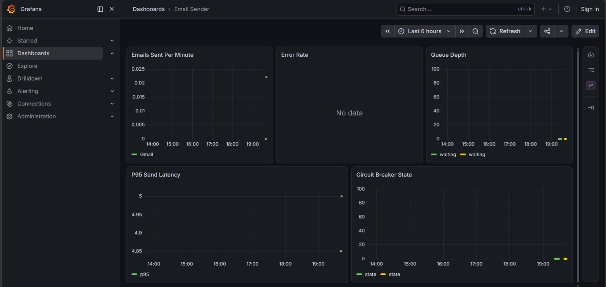
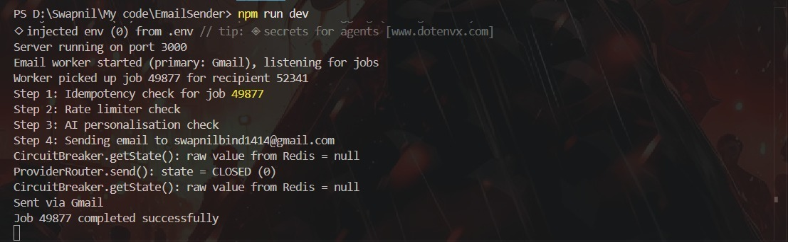
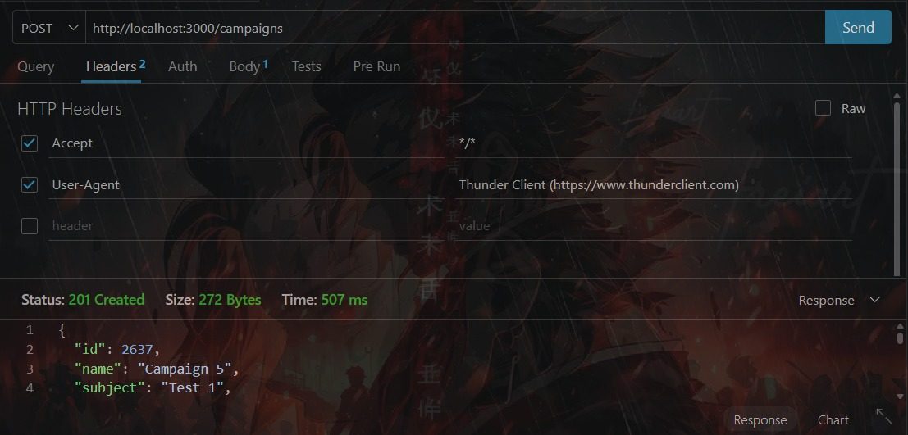

# 📬 Bulk Email Delivery Service
<div align="center">


<p align="center">
A production-grade, multi-provider bulk email delivery platform built with <strong>Express, BullMQ, Redis, PostgreSQL, and React</strong>. Designed for high-throughput email campaigns with automatic failover, idempotency, rate limiting, AI-powered subject personalization, and real-time monitoring.
</p>

<p align="center">
  <a href="#-features"><strong>Features</strong></a> •
  <a href="#-architecture"><strong>Architecture</strong></a> •
  <a href="#-screenshots"><strong>Screenshots</strong></a> •
  <a href="#-api-endpoints"><strong>API</strong></a> •
  <a href="#-getting-started"><strong>Getting Started</strong></a> •
  <a href="#-project-structure"><strong>Project Structure</strong></a>
</p>

---
---

# 🏗️ Architecture

```text
                    ┌─────────────┐
                    │   Client    │
                    │ (API / k6)  │
                    └──────┬──────┘
                           │ POST /api/campaigns
                           ▼
              ┌────────────────────────┐
              │   Express (src/)       │
              │  /health   /metrics    │
              │  /api/stats/*          │
              │  /api/campaigns        │
              └────────┬───────────────┘
                       │
              ┌────────▼───────────────┐
              │   BullMQ Queue         │
              │   (Upstash Redis)      │
              └────────┬───────────────┘
                       │ Jobs
              ┌────────▼───────────────┐
              │   BullMQ Worker        │
              │                        │
              │ ┌────────────────────┐ │
              │ │ Idempotency        │ │
              │ │ (SHA-256 Key)      │ │
              │ └────────────────────┘ │
              │           │            │
              │ ┌────────────────────┐ │
              │ │ Rate Limiter       │ │
              │ │ Redis Lua Script   │ │
              │ └────────────────────┘ │
              │           │            │
              │ ┌────────────────────┐ │
              │ │ AI Personaliser    │ │
              │ │ Gemini + Cache     │ │
              │ └────────────────────┘ │
              │           │            │
              │ ┌────────────────────┐ │
              │ │ SendGrid           │ │
              │ │ Circuit Breaker    │ │
              │ └─────────┬──────────┘ │
              │           ▼            │
              │ ┌────────────────────┐ │
              │ │ Mailgun            │ │
              │ └─────────┬──────────┘ │
              │           ▼            │
              │ ┌────────────────────┐ │
              │ │ SMTP Fallback      │ │
              │ └────────────────────┘ │
              └───────────┬────────────┘
                          │
                          ▼
                  Email Delivery
```

---

# 📸 Screenshots

| Brand / Hero Screen | Grafana-style Observability Dashboard |
|----------------------|---------------------------------------|
|  |  |

| Server Runtime Log Stream | Thunder Client Campaign API Request |
|---------------------------|-------------------------------------|
|  |  |

---

# 🚀 What It Does

- Accepts campaign creation requests through `POST /api/campaigns`.
- Enqueues one BullMQ job per recipient and tracks delivery state in PostgreSQL.
- Prevents duplicate sends using Redis-backed idempotency keys.
- Applies a Redis Lua sliding-window rate limiter before every send.
- Automatically fails over from **SendGrid → Mailgun → SMTP**.
- Personalizes email subject lines using **Gemini AI**, Redis caching, and a token bucket.
- Exposes `/health`, `/metrics`, and campaign statistics endpoints.
- Ships with a React dashboard that visualizes delivery rate, queue depth, provider health, and recent failures.

---
# ⭐ Key Features

## ✅ Reliable Delivery

Each email provider is protected by a **Circuit Breaker** with `CLOSED`, `OPEN`, and `HALF_OPEN` states. After **5 consecutive failures**, the provider is temporarily skipped for **30 seconds** before a retry is attempted. This ensures uninterrupted email delivery even if one provider becomes unavailable.

---

## 🔒 No Duplicate Sends

Every email is assigned a unique **SHA-256 idempotency key** and guarded by an atomic Redis `SET NX` operation. Queue retries, worker crashes, and duplicate requests never result in the same email being sent twice.

---

## 🚦 Safe Rate Limiting

A **Redis Lua sliding-window rate limiter** enforces a limit of **100 emails per minute**. If Redis becomes temporarily unavailable, the limiter gracefully fails open to maintain service availability.

---

## 🤖 AI-powered Subject Lines

The personalization service uses **Google Gemini** to generate engaging subject lines. Results are cached in Redis for one hour, protected by a **10 requests/second token bucket**, and automatically fall back to the original subject if AI fails or times out.

---

## 📊 Production Metrics

Prometheus-compatible metrics are exposed through the `/metrics` endpoint, including:

- Emails Sent
- Failed Deliveries
- Queue Depth
- Email Latency
- Circuit Breaker Status
- Rate Limit Rejections
- AI Usage Statistics

---

## 📈 Live Dashboard

The React dashboard provides live operational visibility, including:

- 📧 Total Emails Sent
- 📊 Delivery Rate
- ❌ Failed Deliveries
- ⏳ Queue Depth
- 🟢 Provider Health
- ⚠️ Recent Failures
- 🤖 AI Personalization Toggle

Dashboard statistics refresh automatically every **5 seconds**, while hourly analytics update every **30 seconds**.

---

# 🌐 API Endpoints

| Method | Endpoint | Description |
|---------|----------|-------------|
| GET | `/health` | Health check with uptime and queue status |
| GET | `/metrics` | Prometheus metrics endpoint |
| POST | `/api/campaigns` | Create a campaign and enqueue recipient jobs |
| GET | `/api/campaigns/:id` | Retrieve campaign status and delivery progress |
| GET | `/api/stats/summary` | Overall delivery statistics |
| GET | `/api/stats/hourly` | Email volume over the last 24 hours |
| GET | `/api/stats/providers` | Provider health and usage |
| GET | `/api/stats/failures` | Recent failed deliveries |
| PATCH | `/api/settings/ai` | Enable or disable AI personalization |

---

# 🛠️ Tech Stack

### Backend

- Node.js
- Express.js
- BullMQ
- Redis (Upstash)
- PostgreSQL

### Email Providers

- SendGrid
- Mailgun
- SMTP (Fallback)

### AI

- Google Gemini API

### Monitoring

- Prometheus
- prom-client

### Frontend

- React
- Vite
- Tailwind CSS
- Recharts

---

# 🚀 Getting Started

## Prerequisites

Before running the project, ensure you have:

- Node.js **22+**
- Redis
- PostgreSQL
- At least one configured email provider
- *(Optional)* Google Gemini API key

---

## Installation

```bash
npm install

cd dashboard
npm install
```

---

## Run the Backend

```bash
npm run dev
```

---

## Run the Dashboard

```bash
cd dashboard
npm run dev
```

---

## Verify Installation

```bash
curl http://localhost:3000/health

curl http://localhost:3000/metrics

npm test
```
# ⚙️ Environment Variables

Create a `.env` file in the project root and configure the following variables:

| Variable | Description |
|----------|-------------|
| `REDIS_URL` | Redis connection string used by BullMQ, rate limiter, idempotency, and AI cache |
| `DATABASE_URL` | PostgreSQL connection string |
| `SENDGRID_API_KEY` | SendGrid API key |
| `SENDGRID_FROM` | Verified SendGrid sender email |
| `MAILGUN_API_KEY` | Mailgun API key |
| `MAILGUN_DOMAIN` | Mailgun sending domain |
| `MAILGUN_FROM` | Mailgun sender address |
| `SMTP_HOST` | SMTP server hostname |
| `SMTP_PORT` | SMTP server port |
| `SMTP_USER` | SMTP username |
| `SMTP_PASS` | SMTP password |
| `SMTP_FROM` | SMTP sender email |
| `SMTP_SECURE` | `true` for TLS, otherwise `false` |
| `GOOGLE_API_KEY` | Google Gemini API key |
| `AI_PERSONALISATION_ENABLED` | Enable or disable AI-generated subject lines |
| `PORT` | Backend server port (default: `3000`) |

---

# 📜 Available Scripts

## Backend

```bash
npm install
npm run dev
npm start
npm test
npm run metrics
```

### Dashboard

```bash
cd dashboard

npm install
npm run dev
npm run build
```

---

# 🧪 Load Testing

The project includes **k6** load tests for validating bulk email throughput under realistic workloads.

Run locally:

```bash
k6 run load-tests/campaign.js
```

Run against a deployed server:

```bash
k6 run -e BASE_URL=https://your-domain.com load-tests/campaign.js
```

---

# 📂 Project Structure

```text
.
├── dashboard/              # React + Vite monitoring dashboard
├── load-tests/             # k6 performance tests
├── src/
│   ├── db/                 # PostgreSQL configuration
│   ├── queues/             # BullMQ queue definitions
│   ├── routes/             # REST API endpoints
│   ├── services/           # Email providers, AI, rate limiter, metrics
│   ├── utils/              # Utility helpers
│   └── workers/            # BullMQ email workers
├── tests/                  # Integration and unit tests
├── Photos/                 # README screenshots
├── package.json
└── README.md
```

---

# 📊 Monitoring & Dashboard

The built-in dashboard provides live operational insights, including:

- 📧 Total Emails Sent
- 📈 Delivery Success Rate
- ❌ Failed Deliveries
- ⏳ Queue Depth
- 🟢 Provider Health Status
- ⚡ Email Throughput
- 🤖 AI Personalization Status
- 📋 Recent Delivery Failures

Metrics are exposed in **Prometheus** format and can be visualized using **Grafana**.

---

# 📝 Notes

- Every email is protected using Redis-backed idempotency keys to eliminate duplicate sends.
- Circuit breakers automatically switch providers when failures occur.
- AI personalization is optional and gracefully falls back to the original subject line.
- The React dashboard consumes backend APIs and can be deployed independently.
- All screenshots used in this README are stored inside the `Photos/` directory.

---

# 🚀 Future Improvements

- Multi-tenant campaign management
- Email template builder
- Webhook support for delivery events
- Campaign scheduling
- Recipient segmentation
- Open and click tracking
- Docker Compose production deployment
- Kubernetes deployment manifests

---

# 🤝 Contributing

Contributions are welcome!

1. Fork the repository.
2. Create a new feature branch.
3. Commit your changes.
4. Push your branch.
5. Open a Pull Request.

---

# 📄 License

This project is licensed under the **MIT License**.

---

## ⭐ Support

If you found this project useful, consider giving it a ⭐ on GitHub!
